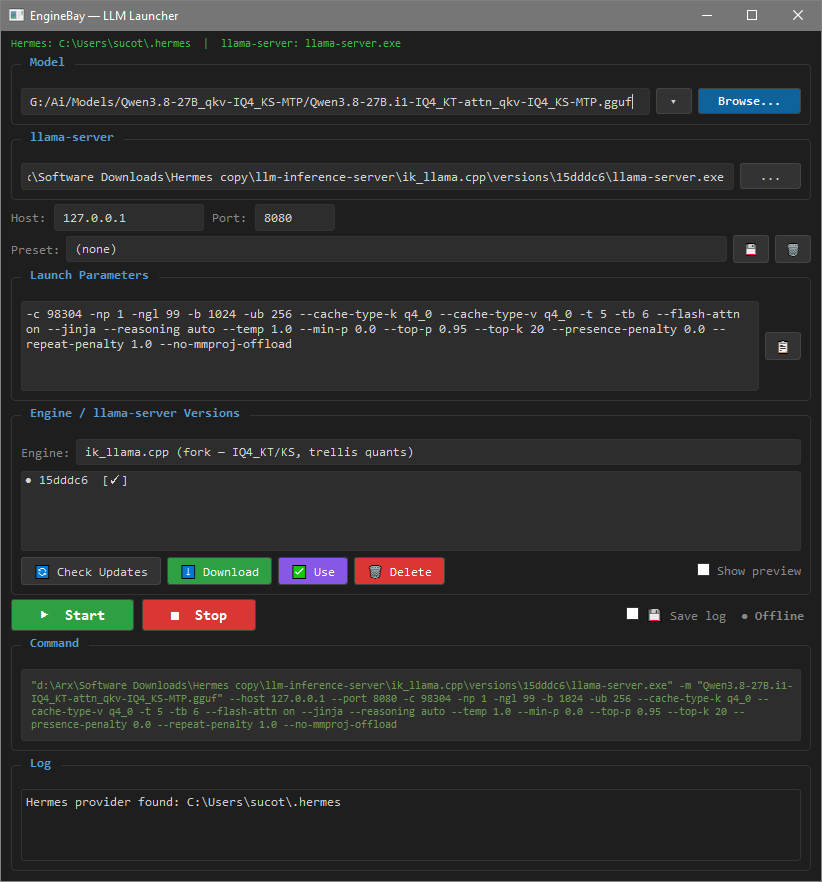

# EngineBay — LLM Inference Server



Local llama.cpp inference server with PyQt6 GUI launcher, multi-engine support,
and version management. Provides OpenAI-compatible API for Hermes CLI client
and DeepSeek Harness GUI.

**Primary model:** Qwen3.8-27B (IQ4_KT/KS / IQ4_XS, ~14 GB GGUF) on **RTX 4070 Ti SUPER
(16 GB VRAM)**. Achieved: **35.9 t/s** at 96K context (pure mode, ik_llama.cpp),
**~30x on repeated agent requests** (prompt cache in RAM, verified 26.5s warmup → 0.86s repeats).

## Features

- **PyQt6 GUI launcher** — model selection, presets, llama.cpp version management
- **Auto-discovery** — finds Hermes config and llama-server binary automatically
- **Version manager** — download, install, and switch between llama.cpp releases from GitHub
- **Multi-engine support** — select between upstream llama.cpp, BeeLlama.cpp (fork), and ik_llama.cpp (fork, source-built) with per-engine version management, download, and activation
- **Engine-safe presets** — presets carry params/host/port only (never model paths); incompatible flags are auto-detected when switching engines or loading presets, with a warning dialog instead of a crash
- **Health monitor** — real-time server status in the GUI
- **Hermes + DeepSeek Harness sync** — auto-registers the running server as a local provider in both `~/.hermes/config.yaml` and `~/.dsh/settings.yaml`, keeping the port in sync when you change it in the GUI

> Engineering notes, measured VRAM budgets, engine flag differences, and build
> gotchas live in **[dev_guide.md](dev_guide.md)**.

## Project Structure

```
enginebay/
├── launcher.py              ← PyQt6 GUI (model selection, presets, engines, versions)
├── launcher_presets.json    ← saved presets (params only — no model paths)
├── launcher_config.json     ← last used config (git-ignored)
├── requirements.txt         ← Python dependencies
├── setup-deps.bat           ← one-time dependency installer
├── dev_guide.md             ← engineering notes, VRAM budgets, engine flags, gotchas
├── AGENTS.md                ← agent instruction file (engine table, build steps)
├── Launcher.vbs             ← launch GUI (no terminal)
├── Launcher.bat             ← launch GUI (fallback)
├── start-llama.bat          ← start server (ik_llama, Qwen3.8-27B, port 8080)
├── start-beellama.bat       ← start server (Qwen3.8-27B, BeeLlama KVarN, port 8080)
├── stop-llama.bat           ← stop server
├── launch-hermes-llama.bat  ← start server + Hermes
├── build-ikllama.bat        ← build ik_llama.cpp from source (manual-build engine)
├── configs/
│   └── inference.env        ← server parameters
├── scripts/
│   ├── start_llama_cpp.sh   ← launcher (Git Bash)
│   ├── start_llama_cpp.bat  ← launcher (Windows CMD)
│   ├── smoke_test.py        ← verify server
│   └── probe_hardware.py    ← detect GPU/CPU/RAM
├── benchmarks/
│   ├── bench.sh             ← TTFT/TPOT benchmark
│   └── systematic_bench.py  ← automated config testing
├── Screenshot/
│   └── enginebay-launcher.png ← GUI screenshot
├── llama.cpp/versions/      ← downloaded upstream llama.cpp releases
├── beellama.cpp/            ← BeeLlama source checkout (reference)
│   └── versions/            ← downloaded BeeLlama releases
├── ik_llama.cpp/            ← ik_llama source + build output (git-ignored; manual-build)
│   └── versions/            ← built llama-server.exe + DLLs
└── pyproject.toml
```

## Client integration (Hermes + DeepSeek Harness)

The launcher auto-registers the running server as a local provider in **both**
clients, and port changes in the GUI auto-sync to both configs:

| Client | Config | Provider | Sync mechanism |
|---|---|---|---|
| **Hermes** CLI | `~/.hermes/config.yaml` | `local-llama` | `_on_port_changed` → regex update of `base_url` |
| **DeepSeek Harness** GUI | `~/.dsh/settings.yaml` | `local_llama` (under `llm-pi-ai.providers`) | `_on_port_changed` → `_dsh_upsert_local_llama()` block-scoped update of `baseURL` |

The provider is created on first launch if missing; only the `local_llama` block
in `settings.yaml` is ever touched. See [AGENTS.md](AGENTS.md#hermes--deepseek-harness-integration).

# EngineBay Technical Documentation

Welcome to the technical documentation for **EngineBay**, a tailored, Windows-optimized `llama.cpp` inference environment equipped with a PyQt6 Graphical User Interface (GUI). This project is specifically engineered to run large models (like Qwen3.8-27B in IQ4_XS / IQ4_KT/KS) natively on consumer-grade hardware (such as the RTX 4070 Ti SUPER with 16GB VRAM) while providing a seamless OpenAI-compatible API for CLI clients like Hermes and GUI clients like DeepSeek Harness.

---

## 1. Real Capabilities of the Program

The application acts as a comprehensive wrapper and manager for local LLM inference, delivering the following core features:

* **PyQt6 GUI Launcher:** A rich graphical interface for managing model selection, network parameters (host/port), and inference flags.
* **Llama.cpp Version Manager:** Automatically fetches release data from the GitHub API, allowing users to download, install, and hot-swap between different `llama-server` binary versions without leaving the UI.
* **Auto-Discovery Engine:** Intelligently locates essential dependencies without manual configuration:
  * Automatically finds existing `llama-server` binaries (via environment variables like `LLAMA_SERVER_PATH`, system `PATH`, or within LM Studio's cache).
  * Auto-discovers the Hermes CLI configuration directory (`~/.hermes/config.yaml`).
* **Hermes + DeepSeek Harness Integration:** Automatically registers and updates the server as a local provider in both `~/.hermes/config.yaml` (`local-llama`) and `~/.dsh/settings.yaml` (`local_llama`), keeping API ports synchronized. The provider is created on first launch if missing.
* **Console-Free Execution:** Utilizes VBScript (`Launcher.vbs`) to start the server and GUI silently in the background, preventing terminal clutter.
* **Health & Status Monitoring:** Built-in polling to verify if the inference server is responding and healthy.

---

## 2. Algorithm of Operation and Architecture

### System Architecture
The repository relies on a loosely coupled architecture separating the graphical management layer from the underlying execution engine:

1. **Presentation & Management Layer (`launcher.py`):** 
   Built using PyQt6. It acts as the orchestrator. State is preserved across sessions using lightweight JSON storage:
   * `launcher_config.json`: Saves the last-used state (model path, binary path, ports).
   * `launcher_presets.json`: Stores user-defined parameter profiles (e.g., specific ports for specific models).
2. **Execution Engine (`llama-server.exe`):**
   The underlying C++ inference backend. When launched via the GUI, a subprocess is created. The GUI intercepts process state and exposes an OpenAI-compatible REST API (typically on port 8080 or 8888).
3. **Integration Layer:**
   When settings change in the GUI, the application parses and mutates the YAML configuration of external agents (like Hermes) to ensure local endpoints are perfectly aligned with the running server.

### Hardware & Model Optimization (Qwen3.8-27B — reference config)
The server is configured around the capabilities of **Qwen3.8-27B** (qwen35
architecture, GGUF). All three engines can run it, but only **ik_llama.cpp**
reads the IQ4_KT/KS trellis quants used in the MTP variant:
* **Measured decode (pure mode, 96K context, ik_llama):** **35.9 t/s** —
  prompt eval 691 t/s (313 tokens). Fits entirely in 16 GB VRAM (CUDA0 buffer
  ~12781 MiB constant, KV separate).
* **MTP speculative decoding:** Up to 47.3 t/s at 48K context, but MTP head
  (~216 MiB) + MTP KV (~72 MiB) overflows VRAM past 48K — **for ≥64K use pure.**
* **Prompt cache (RAM):** Built-in via `--cache-ram 8192` (default on). Measured:
  ~20K-token prefix — warmup 26.5 s, **repeats 0.86 s** (f_keep 1.00, 30965 cached
  tokens). This is a ~30× speedup on repeated agent requests (e.g. Hermes
  system prompt reused across turns).
* **KV cache:** `--cache-type-k q4_0 --cache-type-v q4_0` (q2_0 crashes on this
  model — 0xC0000409). KV at 64K = 1224 MiB, 96K = 1836 MiB.
* **`-np 1` is mandatory** — auto-parallel creates 4 slots × 96K KV, which
  overflows VRAM and drops speed to ~3.8 t/s.
* **`--reasoning auto`** (not `off`) — qwen35 arch breaks with `--reasoning off`
  on tools requests. `--jinja` is also required for tool use.
* **FFN offload to CPU is counterproductive** — even 4 layers dropped decode
  to 10.1 t/s (i7-5820K bottleneck). All layers on GPU is fastest.

---

## 3. Installation and Configuration

### Prerequisites
* **OS:** Windows 10/11
* **Hardware:** Modern GPU with at least 16GB VRAM (e.g., RTX 4070 Ti SUPER)
* **Software:** Python 3.x

### Setup Process
1. Clone the repository to your local machine.
2. Install the necessary Python dependencies — either double-click `setup-deps.bat`
   or run manually:
   ```bash
   pip install -r requirements.txt
   ```
   (Packages: `PyQt6`, `openai`, `httpx` — see `requirements.txt`.)
3. *(Optional but Recommended)* Ensure `llama-server.exe` is either in your system PATH, or download it directly through the Launcher's built-in Version Manager. The **ik_llama.cpp** engine has no prebuilt binaries — use `build-ikllama.bat` to build it (the release archive ships it pre-built).

### Critical Server Tuning & Constraints
To achieve optimal performance (**~35.9 tokens/sec decoding at 96K on ik_llama**,
see the Hardware section above), you **must** adhere to the following configuration constraints:

* **Optimal Context Limit (`-c 98304`):** 96K is the absolute optimal context. Pushing the context to 128K will degrade decoding speeds (measured 32.1 t/s vs 35.9 t/s).
* **KV Cache Quantization (`--cache-type-k q4_0 --cache-type-v q4_0`):** Both Key and Value caches **must** be quantized to `q4_0`. Higher precision (like `q8_0`) at large contexts exhausts VRAM; `q2_0` crashes this model (0xC0000409).
* **CPU MoE Flag:** Do not use `--n-cpu-moe`. Qwen3.8-27B is a dense model; this flag will have no effect.
* **Reasoning mode:** On qwen35 (Qwen3.8-27B) use `--reasoning auto` + `--jinja` — `--reasoning off` breaks tools requests on this architecture. (Upstream Qwen3.6-27B still uses `--reasoning off`.)

### Alternative Engines (BeeLlama.cpp)

The launcher can manage multiple llama-server engines. Besides upstream `llama.cpp`, it supports **BeeLlama.cpp** — a performance-focused fork that adds:

- **KVarN KV-cache quantization** — variance-normalized cache types `kvarn2`–`kvarn8` (e.g. `--cache-type-k kvarn5 --cache-type-v kvarn4`)
- **KV cache precision tail** — keep recent tokens exact in F16/BF16 (`--kv-tail-tokens 1024`)
- **Additional low-bit caches** — `q2_0`–`q6_1`
- **Adaptive DFlash draft control** and **reasoning-loop protection**

To use it:

1. Open `Launcher.bat`
2. Set the **Engine** dropdown to `BeeLlama.cpp (fork)`
3. **Check Updates** → download a Windows CUDA build (e.g. `v0.4.3-cuda-13.3`)
4. Click **Use** to activate the binary
5. Load the `Qwen3.8-27B (Bee KVarN pure)` preset — it swaps the KV cache to KVarN + 1024-token tail

Each engine keeps its own versions directory (`llama.cpp/versions/` vs `beellama.cpp/versions/`), so you can switch back and forth freely. See [AGENTS.md](AGENTS.md#alternative-engines) for how to register additional engines.

### ik_llama.cpp (fork — trellis quants, manual build)

**ik_llama.cpp** is the **only engine that can read the IQ4_KT/IQ4_KS trellis
quants** (ggml types 144/145, e.g. `Qwen3.8-27B.i1-IQ4_KT-attn_qkv-IQ4_KS-MTP.gguf`).
Neither beellama (stops at type 49) nor vllm.cpp (decodes only up to IQ4_XS) can
open these files.

- **No prebuilt Windows binaries** (tag `t0002`, 0 assets) — build from source via
  `build-ikllama.bat` (CMake + CUDA, arch 89). See [dev_guide.md](dev_guide.md#5-сборка-ik_llama.cpp-из-исходников) for build details.
- Adds speculative MTP chains: `--spec-type ngram-mod:... --spec-type mtp:...`
  (two-stage), but on 16GB VRAM MTP only fits up to 48K context — **for ≥64K use
  the pure preset** (measured 35.9 t/s @ 96K).
- Does **not** support `--kv-unified`, `kvarn*`, `--kv-tail-tokens`, or
  `draft-mtp` (beellama flags). The launcher detects these and warns.

### Engine-safe presets

Presets store **params/host/port only — never model paths** (the model is picked
in the GUI). Because each engine uses different flag names for the same concept
(KV cache, speculative decoding, reasoning), the launcher:

1. Resets params to the engine's defaults whenever you switch engines;
2. Detects stale/foreign flags on config load and resets to safe defaults;
3. **Warns with a dialog when you load a preset whose flags the current engine
   cannot parse** (offers "Load engine defaults" or "Apply preset anyway").

---

## 4. Usage Examples

### 1. Launching the GUI (Recommended)
To open the graphical interface without spawning an annoying terminal window, double-click:
```text
Launcher.vbs
```
*Alternatively, you can run `Launcher.bat` or execute `python launcher.py` from your terminal.*

### 2. One-Click Launch (Server + Client)
If you want to immediately boot the inference server, wait for the model to load into VRAM, and simultaneously start the Hermes CLI client attached to it, run:
```bat
launch-hermes-llama.bat
```

### 3. CLI: The Optimal Launch Command
If you are bypassing the GUI and scripting your own environment, use this
optimized launch string for **Qwen3.8-27B on ik_llama.cpp** (96K pure,
measured **35.9 t/s**). Note the flags differ from upstream llama.cpp —
`--reasoning auto`, no `--kv-unified`, MTP omitted at ≥64K context:

```bash
llama-server \
  -m "/path/to/Qwen3.8-27B.i1-IQ4_KT-attn_qkv-IQ4_KS-MTP.gguf" \
  -c 98304 -np 1 -ngl 99 -b 1024 -ub 256 \
  --cache-type-k q4_0 --cache-type-v q4_0 \
  -t 5 -tb 6 --flash-attn on --jinja --reasoning auto \
  --temp 1.0 --min-p 0.0 --top-p 0.95 --top-k 20 \
  --presence-penalty 0.0 --repeat-penalty 1.0 --no-mmproj-offload \
  --host 127.0.0.1 --port 8080
```

For **Qwen3.8-27B IQ4_XS** (readable by any engine, incl. upstream llama.cpp):
`-m ".../qwen3.8-27b-IQ4_XS-pure.gguf"` with the same params, but upstream
llama.cpp accepts `--reasoning off` and `--kv-unified`.

### 4. Running the Smoke Test
To verify that your server is running, healthy, and successfully exposing the OpenAI-compatible API, execute the built-in Python diagnostic tool:

```bash
# Ensure your virtual environment is active if applicable
python scripts/smoke_test.py
```
*Output Expectation:* The script will connect to `http://127.0.0.1:8080/v1` and list the available loaded models, confirming API health.

### 5. Probing Hardware Capabilities
To double-check how much VRAM/RAM your system currently has available before loading massive 96K contexts, use the hardware probe script:
```bash
python scripts/probe_hardware.py
```
